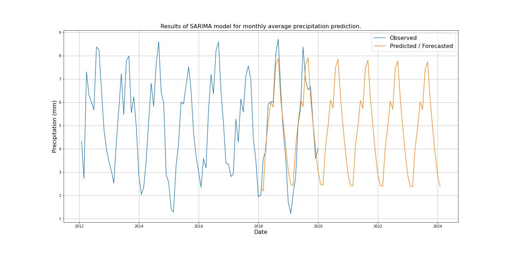

### Project Title
GERD weather forecast
**Author**
Behailu Desta
#### Executive summary
The Grand Ethiopian Renaissance Dam (GERD), is a gravity dam on the Blue Nile River in Ethiopia under construction since 2011. The dam is in the Benishangul-Gumuz Region of Ethiopia, about 45 km (28 mi) east of the border with Sudan.

The primary purpose of the dam is electricity production to relieve Ethiopia's acute energy shortage and for electricity export to neighbouring countries. With a planned installed capacity of 6 gigawatts, the dam will be the largest hydroelectric power plant in Africa when completed,as well as among the 20 largest in the world with planned maximum storage capacity of 74 billion cubic meters of water.

GERD Water shed.

Location of GERD basin on the globe.

#### Rationale
The energy generating capacity of Hydroelectric station is directly affected by the amount of water in the reservoir dam, which is directly impacted by the weather/climate conditions of the surrounding area and the river basins feeding to the Dam. So, climate forecasting for this project will help for power budget planning, how much billion meter cube water to keep/release from the dam, estimate the energy production of the station, plan for best time to schedule for maintenance of the station, over all macro/micro economic planning of the region as its tied to energy.
#### Research Question
Forecast temperature and precipitation on river water sheds that can feed to the GERD dam, and prepare for plan accordingly.

Temperature affects the rate of evaporation from the water surface and transpiration from vegetation along the river. As the temperature increases, so does the rate of evaporation and transpiration, leading to a decrease in the amount of water in the rivers basins of GERD. Which can result in reduced water levels in the dam there by electric generation.

Precipitation, on the other hand, directly affects the amount of water in the rivers. Increased precipitation, such as heavy rainfall, can lead to higher water levels and potentially cause flooding and may overwhelm the dam's storage/release capacity. On the other hand, a lack of precipitation can lead to lower water levels and drought conditions.

In addition, changes in precipitation patterns and amounts can have a long-term impact on the water cycle and the overall health of the river watersheds and there by the dam and its energey generation.

Overall, temperature and precipitation play important roles in determining the water levels and health of a river watersheds feeding the GERD dam, and changes in these factors can have far-reaching in energy generation and ripple effects in the over all socio-economic and situation of the region.

Predict/forecast, The average Temperature, Precipitation by which Climate prediction for GERD. The final result comes with major forecasting in locations in the GERD Basin.

###### Why this question is important

The energy generating capacity of Hydroelectric station is directly affected by the amount of water in the reservoir dam, which is directly impacted by the weather/climate conditions of the surrounding area and the river basins feeding to the Dam. So, climate forecasting for this project will help for power budget planning, how much billion meter cube water to keep/release from the dam, estimate the energy production of the station, plan for best time to schedule for maintenance of the station, over all macro/micro economic planning of the region as its tied to energy.

**Optimal water management:** Hydroelectric dams require a steady flow of water to generate electricity. Accurate predictions of temperature and precipitation can help dam operators manage water resources more efficiently by allowing them to make informed decisions about when to store water, release it, or generate electricity. This helps to maximize the efficiency of the GERD dam and reduce the risk of water shortages.

**Flood control:** Precipitation predictions can be used to anticipate and mitigate the effects of floods. By monitoring weather patterns and forecasting rainfall, GERD dam operators can adjust water release schedules to prevent the dam from being overwhelmed by excess water. This helps to prevent flooding downstream and reduce the risk of property damage and loss of life.

**Environmental management:** Temperature and precipitation predictions can help dam operators manage the environmental impacts of their operations. For example, accurate temperature predictions can help operators control water temperatures to maintain healthy aquatic ecosystems. Similarly, precipitation predictions can help operators manage water quality by adjusting water release schedules to prevent sedimentation and erosion.

**Financial planning:** Predicting temperature and precipitation can also help dam operators plan for future energy demand/shortage and price fluctuations. By forecasting weather patterns and water availability, GERD operators can adjust their operations and pricing strategies to maximize revenue and reduce costs

#### Data Sources
World Weather for Water Data Service (W3S) from a repository of University of Guelph, is a Data as a Service (DaaS) platform that allows me to download climate (precipitation, maximum temperature & minimum temperature) data for the predefined watershed along the GERD basin to develop data-driven rainfall-runoff models. I got data from 2000 and 2019 from this platform.

University of Guelph https://www.uoguelph.ca/watershed/w3s/ Data collected to GERD basin area, shown in the figure below, the red dot is the location of the GERD (Dam).

Data Source : University of Guelph https://www.uoguelph.ca/watershed/w3s/

Downloaded into multiple CSVs https://drive.google.com/drive/folders/1a1h0ZZYdGmd9dJb9ecaDezkhdN1wLvJC

#### Methodology
This a timeseries: Data prep, Data analysis and visualizations (trend/seasonality), testing stationarity, Data transformation, review SARIMA with ACF and PACF to forecast/predict the time series,( predict the average temp and precipitation of GERD basin), some of the well known timeseris models are:
ARIMA (AutoRegressive Integrated Moving Average): ARIMA is a classic time series forecasting method that models the underlying structure in the data and uses this information to make predictions. It is well-suited for weather forecasting because it can capture both short-term and long-term patterns in the data.

SARIMA (Seasonal ARIMA): SARIMA is a variation of ARIMA that includes a seasonal component in the model. This makes it well-suited for weather forecasting, where there are clear seasonal patterns in the data, such as the onset and cessation of rainy seasons.

LSTM (Long Short-Term Memory) in AI/ML. LSTM is a type of recurrent neural network (RNN) that is designed to overcome the problem of vanishing gradients, which occurs in traditional RNNs when they try to propagate error gradients back through many time steps.

The goal is to predict future weather conditions on the GERD basin based on past observations. Using some of the popular time series forecasting models for weather forecasting.

#### Models and Results
We did the modeling using SARIMA and LSTM from recurrent neural network. For SARIMA we used custom gridserach function to find the order and seasonality hyperparameters for each dataset with lowest mean square error (MSE).
+ **SARIMA** - Seasonal Auto Regression Integrated Moving Average

- **Temperature**

- Monthly Average

- Weekly average

- **Precipitation**

- Monthly Average

- Weekly average

+ **LSTM** - Long Short-Term Memory

- **Temperature**

- Monthly Average

- Weekly average

- **Precipitation**

- Monthly Average

- Weekly average

#### Conclusion and Recommendation for future imporovement
We couldn't find more data about Dew Point, Humidity, wind speed, visiblity, pressure, etc which definetly help better imporve the quality of our model's prediction/forecast.

The other factor is due to lack of powerful computing machine my gridsearch only limited to only few parameters, using a powerful computer chan help span the search range and get hyperparameters that can deliver improved performance.

Predicting temperature and precipitation for GERD river basin have several benefits,such as:

**Optimal water management:** Hydroelectric dams require a steady flow of water to generate electricity. Accurate predictions of temperature and precipitation can help dam operators manage water resources more efficiently by allowing them to make informed decisions about when to store water, release it, or generate electricity. This helps to maximize the efficiency of the GERD dam and reduce the risk of water shortages.

**Flood control:** Precipitation predictions can be used to anticipate and mitigate the effects of floods. By monitoring weather patterns and forecasting rainfall, GERD dam operators can adjust water release schedules to prevent the dam from being overwhelmed by excess water. This helps to prevent flooding downstream and reduce the risk of property damage and loss of life.

**Environmental management:** Temperature and precipitation predictions can help dam operators manage the environmental impacts of their operations. For example, accurate temperature predictions can help operators control water temperatures to maintain healthy aquatic ecosystems. Similarly, precipitation predictions can help operators manage water quality by adjusting water release schedules to prevent sedimentation and erosion.

**Financial planning:** Predicting temperature and precipitation can also help dam operators plan for future energy demand/shortage and price fluctuations. By forecasting weather patterns and water availability, GERD operators can adjust their operations and pricing strategies to maximize revenue and reduce costs.

**Recommendations:**
These analysis and prediction for the GERD basin can be further improved by takeing the following measures and resoureces.

- High-Quality Data: Accurate and timely data is crucial for a weather forecasting model. We have only data from 2000 to 2019 from University of Guelph which only have temperature and precipitation but adding Dew Point, Humidity, wind speed, visiblity, pressure will definetly further imporve the model's performance

- Machine Learning Algorithms: Due to factors related to experience and time, we havent explored more ML algorithms.Choosing the right machine learning algorithm can make a significant difference in forecasting accuracy. Different algorithms have different strengths and weaknesses, and selecting the best algorithm for a particular dataset can improve the model's performance.

- Ensemble Techniques: Ensemble techniques involve combining multiple models to improve the accuracy of the final forecast. These techniques can include using multiple algorithms, training models on different subsets of data, and combining the forecasts of multiple models.

- Continuous Learning: Weather patterns can change quickly, so it's important to update the model with new data regularly but on the current analysis we have data only until 2019. A model that can continuously learn from new data can adapt to changing weather patterns and improve its accuracy over time.

- Domain Expertise: Incorporating domain expertise into the model can help to improve the accuracy of the forecast and the ability to read and analyse data from the presepective of its impart on the GERD hydroelectric econsystem.

#### Additional resource

- [For all the detailed analysis and work click this link](Capstone_behailud_main.ipynb)
